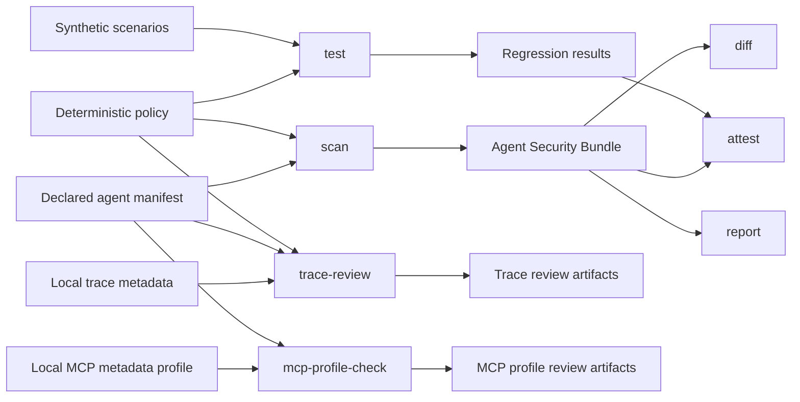

# TrustWeave

> **Review declared AI-agent trust boundaries like code—locally, deterministically, and without running the agent.**

TrustWeave is a Python tool for developers and security reviewers who need to examine an AI agent's **declared** sources, tools, capabilities, data flows, and deterministic policy before a configuration change is deployed. It produces reviewable JSON and Markdown evidence from local files. It does not execute an agent, invoke a tool, connect to an MCP server, call a model, access credentials, or send network traffic.

| Release | Installation | License | Project home |
| --- | --- | --- | --- |
| [`0.1.1`](https://pypi.org/project/trustweave/0.1.1/) | `python -m pip install trustweave` | [Apache-2.0](LICENSE) | [GitHub repository](https://github.com/MohammadThabetHassan/trustweave) |

## Why TrustWeave

An agent configuration can introduce a sensitive path even when no application code changes. A newly declared untrusted source, a broader tool capability, or a modified policy rule can turn a reviewable design decision into an unnoticed deployment risk. TrustWeave makes those declarations and policy outcomes visible as deterministic local artifacts that a reviewer can inspect, compare, retain, or export.

> **TrustWeave establishes evidence about the declarations and local artifacts it reads.** It does not establish runtime behavior, live MCP-server behavior, authorization correctness, incident conclusions, or that an agent is secure.

## What it does—and what it deliberately does not do

| TrustWeave does | TrustWeave does not do |
| --- | --- |
| Validates local JSON or optional YAML agent manifests and deterministic policies. | Execute manifest commands, agent tools, MCP configurations, or external actions. |
| Creates Agent Security Bundles for declared sources, tools, capabilities, and flows. | Discover servers, call models, scan hosts, inspect repositories, or retrieve remote metadata. |
| Runs synthetic policy scenarios and reports deterministic allow, deny, and approval-required decisions. | Run exploit payloads, process real customer data, or claim general prompt-injection prevention. |
| Compares baseline and candidate evidence, static policy structure, local trace metadata, and local MCP metadata profiles. | Authenticate users, validate tokens, operate approval queues, or enforce deployments. |
| Exports local evidence as Markdown, JSON, an explicitly unsigned statement, or SARIF 2.1.0. | Create signed provenance, upload SARIF, publish findings, or contact a third-party service. |

## Install

TrustWeave supports **Python 3.11 or later**. The core JSON workflow has no required runtime dependencies.

```bash
python -m pip install --upgrade trustweave
trustweave --help
```

Safe YAML parsing is optional:

```bash
python -m pip install "trustweave[yaml]"
```

For source development, clone the repository and install the development extras:

```bash
git clone https://github.com/MohammadThabetHassan/trustweave.git
cd trustweave
python -m pip install -e ".[dev]"
```

## First successful review

The following fully synthetic example creates an evidence bundle, runs the default policy scenarios, links the artifacts locally, renders a report, and verifies the local hash chain. It does not interact with an agent or external system.

```bash
rm -rf artifacts

trustweave scan \
  --manifest examples/support-agent.manifest.json \
  --policy policies/default-policy.json \
  --output-dir artifacts

trustweave test \
  --policy policies/default-policy.json \
  --scenarios scenarios/default-scenarios.json \
  --output-dir artifacts

trustweave attest \
  --source-revision "$(git rev-parse --short HEAD 2>/dev/null || echo local)" \
  --output-dir artifacts

trustweave report --output-dir artifacts
trustweave verify --attestation artifacts/attestation.json
```

A successful run writes the following local evidence files:

| Artifact | Purpose |
| --- | --- |
| `artifacts/agent-security-bundle.json` | Deterministic decisions for every declared flow in the manifest. |
| `artifacts/security-test-results.json` | Results for fixed synthetic policy scenarios. |
| `artifacts/attestation.json` | Local hash-linked integrity statement for the generated bundle and test result. |
| `artifacts/report.md` | Human-readable summary of findings, evidence, and limits. |

## Choose the review workflow you need

| Review question | Start with | Primary result |
| --- | --- | --- |
| What trust-boundary paths does this declared agent contain? | [`scan`](docs/CLI_REFERENCE.md#scan) | Agent Security Bundle with a decision for every declared flow. |
| Does the declared policy still meet expected behavior in CI? | [`test`](docs/CLI_REFERENCE.md#test) | Synthetic regression result with no real systems or data. |
| Which policy boundary does a cited synthetic adversarial pattern illustrate? | [`explain`](docs/CLI_REFERENCE.md#explain) | Local Markdown explanation with no prompt, payload, model, or tool execution. |
| Did a proposed configuration change introduce a material declared path or capability? | [`diff`](docs/CLI_REFERENCE.md#diff) | Baseline-versus-candidate bundle diff and focused review signals. |
| Is a policy structurally reviewable and fail-closed on sensitive paths? | [`policy-check`](docs/CLI_REFERENCE.md#policy-check) | Static policy findings, including ordered-rule and approval-boundary signals. |
| Does minimized local trace metadata match the declared manifest and policy? | [`trace-review`](docs/TRACE_REVIEW.md) | Privacy-preserving local trace-review evidence. |
| Does provided MCP metadata map safely to declared tools and action classes? | [`mcp-profile-check`](docs/MCP_PROFILE.md) | Static local profile-to-manifest review with no server connection. |
| Do I need to turn an already-recorded MCP tools list into a reviewer-owned inventory? | [`mcp-import`](docs/MCP_IMPORT.md) and the [reviewer workflow](docs/REVIEWER_WORKFLOW.md) | A deterministic inventory and a human-resolved manifest scaffold. |
| Do I need interoperable local findings for a compatible static-analysis consumer? | [`sarif`](docs/CLI_REFERENCE.md#sarif) | Deterministic local SARIF 2.1.0; no automatic upload. |
| Do I need a statement-shaped representation of existing local integrity evidence? | [`statement`](docs/CLI_REFERENCE.md#statement) | An explicitly unsigned local statement. |

The complete command contract, including inputs, output files, exit codes, and error behavior, is in the [CLI reference](docs/CLI_REFERENCE.md).

## Key review workflows

### Compare a baseline and a candidate declaration

Create evidence for each declaration and then diff the generated bundles. The checked-in candidate adds a **synthetic** external archive capability. TrustWeave reports the declared change and a review signal; it does not enable or invoke that capability.

```bash
rm -rf review-artifacts

trustweave scan \
  --manifest examples/support-agent.manifest.json \
  --policy policies/default-policy.json \
  --output-dir review-artifacts/base

trustweave scan \
  --manifest examples/support-agent.candidate.manifest.json \
  --policy policies/default-policy.json \
  --output-dir review-artifacts/head

trustweave diff \
  --base review-artifacts/base/agent-security-bundle.json \
  --head review-artifacts/head/agent-security-bundle.json \
  --output-dir review-artifacts/diff
```

To focus on least privilege for an existing sensitive tool, use `examples/support-agent.capability-growth.manifest.json` as the head manifest. The output inventories the added declared capability and emits `TW-DIFF-003` when review is required.

### Review policy structure and approval declarations

```bash
trustweave policy-check \
  --policy policies/default-policy.json \
  --output-dir artifacts \
  --exit-on-review
```

The reference policy declares an approval-control boundary for its conditional external path. `policy-check` records whether that declaration is present, bound to actor/action context and expiry metadata, and intended to fail closed. It does **not** implement an approval queue, authenticate a reviewer, or validate approval at runtime.

### Exercise safe, cited synthetic scenarios

```bash
trustweave test \
  --policy policies/default-policy.json \
  --scenarios scenarios/adversarial-scenarios.json \
  --output-dir artifacts/adversarial

trustweave explain \
  --scenarios scenarios/adversarial-scenarios.json \
  --scenario-id TW-ADV-001
```

The adversarial library contains entirely synthetic, taxonomy-cited labels and expected local policy outcomes. It contains no prompt payloads, target systems, or live exploit behavior. See [scenario scope and citations](docs/SCENARIOS.md).

### Review recorded local trace metadata

```bash
trustweave trace-review \
  --manifest examples/support-agent.manifest.json \
  --policy policies/default-policy.json \
  --trace examples/traces/clear-support-trace.json \
  --output-dir artifacts/trace-clear \
  --exit-on-review
```

Trace review compares minimized local event metadata with declared flows and deterministic policy. It excludes message content and tool arguments from its reports. A review finding asks a human to compare the local evidence; it is not an incident conclusion. See the [trace-review contract](docs/TRACE_REVIEW.md).

### Review supplied MCP metadata without connecting

```bash
trustweave mcp-profile-check \
  --manifest examples/support-agent.manifest.json \
  --profile examples/mcp-profiles/clear-support-profile.json \
  --output-dir artifacts/mcp-clear \
  --exit-on-review
```

This command reviews an already-provided local metadata profile. It does not discover an MCP server, open HTTP or stdio, retrieve server metadata, exchange credentials, validate a token, or invoke a tool. See the [MCP metadata profile guide](docs/MCP_PROFILE.md).

## Evidence model



| Command | Establishes | Does not establish |
| --- | --- | --- |
| `scan` | Deterministic decisions for every declared flow. | Runtime discovery, tool execution, or deployed-agent security. |
| `test` | Whether local synthetic scenarios match the current policy. | Model-level behavior or a live attack result. |
| `policy-check` | Structural policy findings and review obligations. | Business authorization correctness or runtime enforcement. |
| `diff` | Declared source, tool, capability, path, rule, and decision changes. | Undeclared runtime behavior or a vulnerability verdict. |
| `trace-review` | Mismatches between safe local trace metadata, declared flows, and policy. | Trace authenticity, complete incident reconstruction, or message inspection. |
| `mcp-profile-check` | Mismatches between a provided local MCP profile and a manifest. | Server discovery, OAuth, token validation, conformance, or live capability validation. |
| `attest` and `verify` | Internal hash-chain consistency among local artifacts. | External signing, identity, non-repudiation, or transparency-log inclusion. |

## Documentation map

| Document | Use it for |
| --- | --- |
| [CLI reference](docs/CLI_REFERENCE.md) | Exact command inputs, outputs, exit codes, and error behavior. |
| [Reviewer workflow](docs/REVIEWER_WORKFLOW.md) | Turning local MCP inventories into human-resolved evidence. |
| [Architecture](docs/ARCHITECTURE.md) | Components, data flows, invariants, and extension boundaries. |
| [Product contract](docs/PRODUCT_CONTRACT.md) | User promise, evidence model, safety boundary, and acceptance criteria. |
| [Threat model](docs/THREAT_MODEL.md) | Assumptions, threat boundaries, and non-goals. |
| [Quality evidence](docs/QUALITY.md) | Local and hosted verification evidence. |
| [Schemas and compatibility](docs/SCHEMA_AND_COMPATIBILITY.md) | Versioned input/output contracts and change policy. |
| [Release procedure](docs/RELEASE.md) | Evidence and authorization requirements for releases. |
| [Roadmap](docs/ROADMAP.md) | Completed work, deliberate limits, and evidence-based next steps. |

## Quality and maintenance

TrustWeave `0.1.1` is published on [PyPI](https://pypi.org/project/trustweave/). Its release target passed formatting, linting, strict type checks, static source-security scanning, a 90% branch-coverage gate, isolated wheel installation, fixed-epoch wheel reproducibility, dependency auditing, CycloneDX SBOM generation, deterministic repository-reality checks, and cross-platform Python 3.11/3.13 compatibility jobs.

The project keeps its contract deliberately conservative: `v1alpha1` input and generated-artifact formats are suitable for the checked-in examples and CI, but may change with documented migration guidance. Read the [compatibility policy](docs/SCHEMA_AND_COMPATIBILITY.md) before depending on a schema or review identifier outside the documented contract.

## Contributing, support, and security

Contributions are welcome when they improve a reviewer's understanding of **declared or pre-recorded local evidence** without crossing the non-executing boundary. Start with [CONTRIBUTING.md](CONTRIBUTING.md), which includes the local quality suite and contribution checklist.

For installation and workflow help, begin with [SUPPORT.md](SUPPORT.md). For bugs and bounded feature requests, use the repository's issue forms. Please **do not** report suspected vulnerabilities in a public issue. Follow [SECURITY.md](SECURITY.md) for the private reporting route and safe-reporting limits. Community conduct expectations are in [CODE_OF_CONDUCT.md](CODE_OF_CONDUCT.md), and maintenance decisions are described in [GOVERNANCE.md](GOVERNANCE.md).

## License

TrustWeave is distributed under the [Apache License 2.0](LICENSE).
