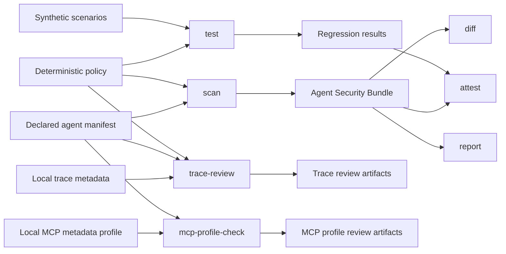

# TrustWeave

> **Review AI-agent trust-boundary changes like code.**

TrustWeave is a local-first developer tool for reviewing the declared data sources, tools, and policy decisions of an AI agent. It turns a small, versioned manifest plus a deterministic policy into reviewable JSON and Markdown evidence. It can also compare two declared architectures and review a **pre-recorded local trace** without executing an agent, tool, model, MCP server, or network request.

TrustWeave is deliberately narrow: it gives reviewers visible evidence before a configuration change becomes deployed behavior. It is **not** a runtime enforcement gateway, a vulnerability scanner for live systems, or proof that an agent is secure.

## Start here

| If you need to… | Start with… | Result |
|---|---|---|
| Review an agent’s declared sources, tools, and flows | [`scan`](docs/CLI_REFERENCE.md#scan) | An Agent Security Bundle with deterministic decisions for every declared flow. |
| Verify expected policy behavior in CI | [`test`](docs/CLI_REFERENCE.md#test) | Synthetic policy-regression evidence that uses no real systems or data. |
| Learn a cited synthetic adversarial pattern and its policy boundary | [`explain`](docs/CLI_REFERENCE.md#explain) | Local Markdown explanation; no prompt, payload, model, or tool execution. |
| Review whether a candidate configuration changed security-relevant paths | [`diff`](docs/CLI_REFERENCE.md#diff) | A baseline-versus-candidate review artifact and focused signals. |
| Review the declared human-approval boundary for high-impact paths | [`policy-check`](docs/CLI_REFERENCE.md#policy-check) | Static evidence that approval controls are declared, bound to the action context, and fail closed. |
| Review a local trace of what was recorded | [`trace-review`](docs/TRACE_REVIEW.md) | A privacy-preserving comparison between trace metadata, declared flows, and policy decisions. |
| Review an MCP integration’s declared metadata before connection | [`mcp-profile-check`](docs/MCP_PROFILE.md) | A static mapping and authorization-expectation review with no server discovery or token handling. |
| Export review findings for a compatible static-analysis consumer | [`sarif`](docs/CLI_REFERENCE.md#sarif) | A deterministic local SARIF 2.1.0 artifact; no automatic upload occurs. |
| Understand limits, artifact meanings, and release checks | [`docs/QUALITY.md`](docs/QUALITY.md) | The exact local and hosted evidence required for a release. |

## Safety boundary

> **TrustWeave reads local declarative files and pre-recorded structured trace metadata only.** It does not execute tool configurations, connect to MCP servers, call models, access credentials, send network traffic, scan hosts, or perform business actions.

Trace review deliberately excludes message content and tool arguments from reports. A finding means that a reviewer should compare local evidence with the declared manifest and policy; it is **not** a vulnerability verdict, incident conclusion, or deployment authorization.

## Quick start

The active repository is private. Authorized collaborators can clone it from:

```bash
git clone https://github.com/MohammadThabetHassan/trustweave.git
cd trustweave
python -m pip install -e .
```

TrustWeave supports Python 3.11 or later. The core JSON workflow has no required runtime dependencies. Safe YAML parsing is optional through `PyYAML`.

### 1. Generate declared-architecture evidence

```bash
rm -rf artifacts

trustweave scan \
  --manifest examples/support-agent.manifest.json \
  --policy policies/default-policy.json \
  --output-dir artifacts

trustweave test \
  --policy policies/default-policy.json \
  --scenarios scenarios/default-scenarios.json \
  --output-dir artifacts

trustweave attest \
  --source-revision "$(git rev-parse --short HEAD 2>/dev/null || echo local)" \
  --output-dir artifacts

trustweave report --output-dir artifacts
trustweave verify --attestation artifacts/attestation.json
trustweave policy-check \
  --policy policies/default-policy.json \
  --output-dir artifacts \
  --exit-on-review
```

The reference policy declares a review-queue approval boundary for its conditional-to-external path. `policy-check` records that declaration and produces review findings if a high-impact approval path lacks a declared control, lacks bindings to the actor, exact action context, and expiry, or does not fail closed. It does **not** implement a queue, authenticate a reviewer, or validate approval at runtime.

The reference agent is fully synthetic. It includes an allowed retrieval path, a confidential-data path that requires approval before a mock external action, and an intentionally unsafe untrusted-content-to-external-action path that policy denies.

### 2. Exercise cited synthetic adversarial patterns

TrustWeave includes a curated library of entirely synthetic, taxonomy-cited trust-boundary patterns. It models labels and expected policy outcomes—not prompts, payloads, target systems, or live exploitation:

```bash
trustweave test \
  --policy policies/default-policy.json \
  --scenarios scenarios/adversarial-scenarios.json \
  --output-dir artifacts/adversarial

trustweave explain \
  --scenarios scenarios/adversarial-scenarios.json \
  --scenario-id TW-ADV-001
```

The library covers prompt-injection-shaped retrieved context, tool-misuse-shaped metadata, confused-deputy paths, excessive agency, sensitive-data routes, supply-chain metadata, and approval-boundary cases using OWASP and MITRE references. A passing result demonstrates only the local policy decision for that synthetic label pair. See [`docs/SCENARIOS.md`](docs/SCENARIOS.md).

### 3. Review a recorded local trace

A trace is **evidence**, not an instruction. The examples contain only synthetic text and mock tool names.

```bash
trustweave trace-review \
  --manifest examples/support-agent.manifest.json \
  --policy policies/default-policy.json \
  --trace examples/traces/clear-support-trace.json \
  --output-dir artifacts/trace-clear \
  --exit-on-review
```

The clear trace exits with status `0`. The following deliberately review-required trace records an untrusted-context event followed by a call that the declared policy denies. It writes evidence and exits with `1` only because `--exit-on-review` was requested.

```bash
trustweave trace-review \
  --manifest examples/support-agent.manifest.json \
  --policy policies/default-policy.json \
  --trace examples/traces/review-required-support-trace.json \
  --output-dir artifacts/trace-review \
  --exit-on-review
```

See the complete privacy, input, and exit-code contract in [`docs/TRACE_REVIEW.md`](docs/TRACE_REVIEW.md).

### 4. Review a candidate architecture change

```bash
rm -rf review-artifacts

trustweave scan \
  --manifest examples/support-agent.manifest.json \
  --policy policies/default-policy.json \
  --output-dir review-artifacts/base

trustweave scan \
  --manifest examples/support-agent.candidate.manifest.json \
  --policy policies/default-policy.json \
  --output-dir review-artifacts/head

trustweave diff \
  --base review-artifacts/base/agent-security-bundle.json \
  --head review-artifacts/head/agent-security-bundle.json \
  --output-dir review-artifacts/diff
```

The candidate adds a synthetic external archive capability. Its untrusted-input path remains denied, but the diff emits a review signal because a human should confirm that the new capability and policy coverage are intentional.

To review a **capability change on an existing sensitive tool**, scan `examples/support-agent.capability-growth.manifest.json` as the head bundle and diff it against the baseline. The generated diff inventories `customer-record.export` as an added capability and emits `TW-DIFF-003`, a least-privilege review signal. The candidate is declarative and synthetic: it does not export a record or enable a runtime action.

### 5. Export local review evidence as SARIF

After generating one or more review artifacts, export their existing findings as deterministic SARIF 2.1.0 data:

```bash
trustweave sarif \
  --policy-review artifacts/policy-review.json \
  --output artifacts/trustweave.sarif
```

The command is a local format conversion only. It preserves review identifiers, messages, and artifact locations, creates stable result fingerprints, and does **not** upload to GitHub, enable code scanning, connect to a service, or make a runtime-security claim. See the [SARIF CLI contract](docs/CLI_REFERENCE.md#sarif).

### 6. Normalize an already-recorded MCP tools list

```bash
trustweave mcp-import \
  --tool-list examples/mcp-tools/support-tools-list.json \
  --output-dir artifacts/mcp-inventory
```

This strictly validates and sorts a supplied MCP `tools/list` snapshot into an inventory. It does **not** fetch the list, open a transport, infer authorization or an action class, process credentials, or call a tool. MCP annotations remain review metadata and are not trusted authority. See [`docs/MCP_IMPORT.md`](docs/MCP_IMPORT.md).

### 7. Review declared MCP metadata without connecting

```bash
trustweave mcp-profile-check \
  --manifest examples/support-agent.manifest.json \
  --profile examples/mcp-profiles/clear-support-profile.json \
  --output-dir artifacts/mcp-clear \
  --exit-on-review
```

This maps an explicit local MCP metadata profile to the Agent Security Manifest. It does **not** discover a server, open HTTP or stdio, retrieve metadata, exchange credentials, validate a token, or invoke a tool. See [`docs/MCP_PROFILE.md`](docs/MCP_PROFILE.md) for the strict input and review contract.

## Evidence workflow



| Command | Primary artifact | What the artifact establishes | What it does **not** establish |
|---|---|---|---|
| `scan` | `agent-security-bundle.json` | Deterministic decisions for every **declared** flow. | Runtime discovery, tool execution, or security of a deployed agent. |
| `test` | `security-test-results.json` | Whether synthetic trust/action scenarios match the current policy. | Model-level behavior or a live attack result. |
| `policy-check` | `policy-review.json` and `.md` | Structural policy findings such as shadowed rules or review-sensitive allow/default decisions. | Correct business authorization or runtime enforcement. |
| `diff` | `bundle-diff.json` and `.md` | Declared source, tool, **capability**, path, rule, and decision changes between bundles. | Undeclared runtime behavior or a vulnerability verdict. |
| `trace-review` | `trace-review.json` and `.md` | Mismatches between safe local trace metadata, declared flows, and policy decisions. | Trace authenticity, full incident reconstruction, or message-content inspection. |
| `mcp-profile-check` | `mcp-profile-review.json` and `.md` | Mismatches between a local MCP profile and declared manifest tool/action-class mappings. | Server discovery, OAuth, token validation, MCP conformance, or live capability validation. |
| `attest` and `verify` | `attestation.json` | Internal hash-chain consistency among local artifacts. | External signing, identity, non-repudiation, or transparency-log inclusion. |

## Documentation map

| Document | Purpose |
|---|---|
| [CLI reference](docs/CLI_REFERENCE.md) | Inputs, outputs, exit codes, and errors for every command. |
| [Trace review guide](docs/TRACE_REVIEW.md) | Trace contract, privacy boundary, review outcomes, and CI usage. |
| [MCP metadata profile guide](docs/MCP_PROFILE.md) | Safe profile contract, mapping review, and strict non-connection boundary. |
| [Architecture](docs/ARCHITECTURE.md) | Components, data flows, invariants, and extension boundaries. |
| [Product contract](docs/PRODUCT_CONTRACT.md) | Explicit user promises, non-goals, and acceptance evidence. |
| [Threat model](docs/THREAT_MODEL.md) | Assumptions, control boundaries, and out-of-scope threats. |
| [Quality evidence](docs/QUALITY.md) | Required local and hosted checks before a direct commit or release. |
| [Schema and compatibility](docs/SCHEMA_AND_COMPATIBILITY.md) | Current schemas and rules for compatible changes. |
| [Roadmap](docs/ROADMAP.md) | Planned work and deliberately deferred integrations. |
| [Release procedure](docs/RELEASE.md) | Versioning, evidence, and authorization gates for releases. |

## Local verification

The repository CI verifies the same core controls. Run these commands from a clean checkout before a direct commit:

```bash
python -m pip install -e . bandit build pip-audit pytest ruff mypy PyYAML

ruff format --check .
ruff check .
mypy src
bandit -r src/trustweave -q
pytest
python -m build
pip-audit -r requirements.txt
```

The hosted **Quality and tests** workflow also validates local documentation links, schemas, workflow YAML, and CLI documentation; builds an isolated wheel; runs policy, bundle-diff, capability-growth, offline trace, and MCP metadata references; and uploads generated evidence.

## Contributing and security

Please read [CONTRIBUTING.md](CONTRIBUTING.md), [SECURITY.md](SECURITY.md), and [CODE_OF_CONDUCT.md](CODE_OF_CONDUCT.md) before proposing a change. Contributions must preserve the non-executing core, use synthetic examples, include deterministic tests, state explicit limits, and avoid real credentials, personal data, external targets, or hidden side effects.

## License

TrustWeave is distributed under the [Apache License 2.0](LICENSE).
