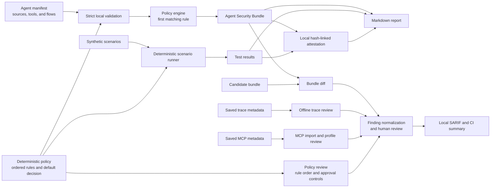

<p align="center">
  
</p>

<h1 align="center">TrustWeave</h1>

<p align="center">
  <strong>Review your AI agent's security configuration before you deploy it.</strong><br>
  Local, deterministic, and fast — no agent runs, no network calls, no data leaves your machine.
</p>

<p align="center">
  <a href="https://pypi.org/project/trustweave/"></a>
  <a href="https://github.com/MohammadThabetHassan/trustweave/actions/workflows/ci.yml"></a>
  <a href="https://pypi.org/project/trustweave/"></a>
  <a href="LICENSE"></a>
</p>

<p align="center">
  <a href="#try-it-in-two-minutes">Try it</a> ·
  <a href="#why">Why</a> ·
  <a href="docs/site/INTEGRATIONS.md">Integration routes</a> ·
  <a href="docs/CLI_REFERENCE.md">CLI reference</a> ·
  <a href="docs/site/CURRENT_EVIDENCE.md">Current evidence</a> ·
  <a href="#docs">Docs</a> ·
  <a href="SECURITY.md">Security</a>
</p>

---

## Try it in two minutes

```bash
python -m pip install --upgrade trustweave
```

Point `scan` at a declared agent manifest and a policy:

```bash
git clone https://github.com/MohammadThabetHassan/trustweave.git
cd trustweave
python -m pip install -e .

trustweave scan \
  --manifest examples/support-agent.manifest.json \
  --policy policies/default-policy.json \
  --output-dir artifacts
```

You get a decision for every declared trust-boundary path — which sources may use which tools, and under what conditions:

| Source | Trust | Tool | Decision |
|---|---|---|---|
| customer_request | trusted | search_knowledge_base | **allow** |
| customer_record | conditional | send_mock_email | **require_approval** |
| customer_request | trusted | lookup_customer_record | **deny** |
| knowledge_base_document | untrusted | send_mock_email | **deny** |

Then check the policy against synthetic scenarios, and produce a report a human reviewer can actually read. Three suites ship with the project — the boundary regressions used below, 25 attack-shaped adversarial patterns, and a 12-case matrix covering every trust/action combination including the flows that must stay permitted. The [scenario catalogue](scenarios/README.md) tables each case, what it targets, and the rule that decides it.

```bash
trustweave test \
  --policy policies/default-policy.json \
  --scenarios scenarios/default-scenarios.json \
  --output-dir artifacts

trustweave attest --source-revision local --output-dir artifacts
trustweave report --output-dir artifacts

# Confirm the evidence files haven't changed since the attestation:
trustweave verify \
  --attestation artifacts/attestation.json \
  --bundle artifacts/agent-security-bundle.json \
  --test-results artifacts/security-test-results.json
```

The example uses only checked-in local files. Inspect any command with `trustweave --help` or `python -m trustweave --help`. For a more involved walkthrough, see the [research-assistant demo](demo/research-assistant/) or the [step-by-step guide](docs/site/WALKTHROUGH.md).

Bundles follow the `trustweave.dev/bundle/v1alpha2` contract, and risk decisions use stable `trustweave/fingerprint/v3` identities. Passing bundle and test-result paths to `verify` checks those exact local bytes; with only an attestation, `verify` checks only the statement’s internal consistency.

## Why

A config change can open a new sensitive path — an untrusted source reaching an external tool — without touching application code. TrustWeave catches that at review time:

- **`scan`** maps every declared flow (source → tool → action) and applies your policy deterministically.
- **`diff`** shows exactly what a candidate config changes versus your baseline.
- **`discover`** parses local Python source to list the tools an agent can reach, proposes an action class for each with the evidence behind it, and reports what the manifest does not declare.
- **`test`** replays safe synthetic scenarios so policy regressions fail in CI, not in production.
- **`trace-review`** and **`mcp-profile-check`** flag where recorded metadata drifts from the declaration.

TrustWeave reviews *declarations*—manifests, policies, and saved snapshots—not a live deployment. It produces stable evidence for a human reviewer; the final judgment stays with you.

## How the local evidence workflow fits together

The workflow turns declared local files and previously saved metadata into review artifacts. It is an evidence path, not an enforcement path; the final review decision remains human-owned.



The diagram separates evidence production from enforcement. For example, `require_approval` records the policy outcome and any declared approval bindings; the surrounding workflow—not TrustWeave—implements the actual approval.

### Example policy decision matrix

The quickstart's shipped support-agent policy is ordered: the **first matching rule wins**, and an unmatched declared path receives the explicit `default_decision`. The matrix shows why each example flow is permitted, requires review, or is denied.

| Declared source → tool | Matching rule or fallback | Deterministic decision | Review meaning | Why it is safe to state |
| --- | --- | --- | --- | --- |
| `customer_request` (trusted) → `search_knowledge_base` (read) | `TW-001` | **allow** | Informational local finding | The declared path matches the read-only rule. This describes the manifest and policy; it does not execute a search. |
| `customer_request` (trusted) → `lookup_customer_record` (sensitive) | Explicit default: `deny` | **deny** | High-severity local finding | No earlier rule permits this sensitive path, so the policy fails closed. |
| `customer_record` (conditional) → `send_mock_email` (external) | `TW-002` | **require_approval** | Medium-severity local finding | The policy records a human-review requirement and declared approval bindings; TrustWeave does not implement the approval itself. |
| `knowledge_base_document` (untrusted) → `send_mock_email` (external) | `TW-004` | **deny** | High-severity local finding | Untrusted retrieved content must not drive an external action. The demo tool writes only a local mock event; no email is sent. |

Use `trustweave policy-check` to review ordered-rule shadowing, fail-open defaults, and incomplete approval-control declarations before relying on a policy in CI. For the full contract and artifact boundaries, see the [architecture guide](docs/ARCHITECTURE.md) and [policy review guide](docs/site/POLICY_REVIEW.md).

## Pick your entry point

| You already have… | Start here |
| --- | --- |
| A LangGraph, OpenAI Agents, or CrewAI export | [Framework import](docs/FRAMEWORK_IMPORT.md) |
| A saved MCP `tools/list` snapshot | [MCP import](docs/MCP_IMPORT.md) |
| A CI pipeline | [Local CI integration](docs/CI_INTEGRATIONS.md) |
| Nothing yet — just curious | The quickstart above |

The [Developer integration routes](docs/site/INTEGRATIONS.md) page has copy-paste commands for each path.

<a name="docs"></a>
## Docs

**Using it:** [Installation](docs/site/INSTALLATION.md) · [CLI reference](docs/CLI_REFERENCE.md) · [Rule catalog](docs/site/RULE_CATALOG.md) · [Troubleshooting](docs/site/TROUBLESHOOTING.md) · [Configuration](docs/CONFIGURATION.md)

**Understanding it:** [Concepts](docs/site/concepts.md) · [How it compares](docs/site/COMPARISON.md) · [Architecture](docs/ARCHITECTURE.md) · [Threat model](docs/THREAT_MODEL.md) · [Product contract](docs/PRODUCT_CONTRACT.md) · [Reviewer workflow](docs/REVIEWER_WORKFLOW.md)

**Trusting it:** [Current evidence](docs/site/CURRENT_EVIDENCE.md) · [Quality & test gates](docs/QUALITY.md) · [Mutation testing record](docs/MUTATION_TESTING.md) · [Supply-chain evidence](docs/SUPPLY_CHAIN.md) · [Reproducibility](docs/REPRODUCIBILITY.md) · [Evaluation framework](docs/evaluation/EVALUATION_CHARTER.md)

<details>
<summary><strong>Everything else (schemas, risk, release records)</strong></summary>

- [Schema and compatibility policy](docs/SCHEMA_AND_COMPATIBILITY.md)
- [Local risk management](docs/RISK_MANAGEMENT.md) — fingerprints, baselines, suppressions
- [Control traceability](docs/CONTROL_TRACEABILITY.md)
- [Golden deterministic evidence](docs/GOLDEN_EVIDENCE.md)
- [Resource bounds](docs/RESOURCE_BOUNDS.md)
- [Release guide](docs/RELEASE.md) and [release history](https://github.com/MohammadThabetHassan/trustweave/releases)
- Historical release checklists, migration guides, and audit records live under `docs/archive/` (added in this overhaul)

</details>

## Quality, briefly

95% branch coverage enforced in CI · 98.12% mutation score across fourteen high-risk modules, all survivors triaged · reproducible wheels with fixed epoch · SBOM + PyPI provenance attestations · zero runtime dependencies. The mutation measurement is scoped, recorded on 2026-08-20, and does not establish package-wide security; see the [mutation testing record](docs/MUTATION_TESTING.md). Source metadata is prepared as the unpublished `0.3.1` candidate; [`0.3.0` remains the latest published release](docs/RELEASE.md). Details in [QUALITY.md](docs/QUALITY.md).

Optional: YAML manifest support via `pip install "trustweave[yaml]"`.

## Contributing

Bug reports and PRs welcome — see [CONTRIBUTING.md](CONTRIBUTING.md). Questions start at [SUPPORT.md](SUPPORT.md). Please don't report vulnerabilities in public issues; follow [SECURITY.md](SECURITY.md). Community norms: [CODE_OF_CONDUCT.md](CODE_OF_CONDUCT.md); project decisions: [GOVERNANCE.md](GOVERNANCE.md).

Used TrustWeave on a real agent? A short write-up helps the next team decide — [here's the template](docs/CASE_STUDIES.md).

## License

[Apache License 2.0](LICENSE).
