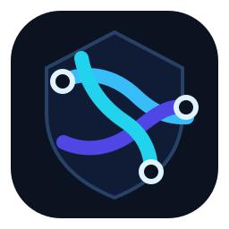

<p align="center">
  
</p>

<h1 align="center">TrustWeave</h1>

<p align="center">
  <strong>Deterministic security evidence for declared AI-agent trust boundaries.</strong><br>
  Review the configuration before deployment—locally, without running the agent.
</p>

<p align="center">
  <a href="https://pypi.org/project/trustweave/"></a>
  <a href="https://github.com/MohammadThabetHassan/trustweave/actions/workflows/ci.yml"></a>
  <a href="https://pypi.org/project/trustweave/"></a>
  <a href="LICENSE"></a>
</p>

<p align="center">
  <a href="#quick-start">Quick start</a> ·
  <a href="docs/CLI_REFERENCE.md">CLI reference</a> ·
  <a href="docs/PRODUCT_CONTRACT.md">Product contract</a> ·
  <a href="docs/REVIEWER_WORKFLOW.md">Reviewer workflow</a> ·
  <a href="SECURITY.md">Security</a>
</p>

---

## The decision TrustWeave helps you make

A configuration change can create a new sensitive path before any application code changes. TrustWeave turns a **declared** agent manifest, deterministic policy, and optional local review inputs into stable JSON and Markdown evidence a reviewer can inspect, compare, retain, or export.

| If you need to answer… | TrustWeave gives you… |
| --- | --- |
| *What sources, tools, capabilities, and flows are declared?* | An **Agent Security Bundle** with a deterministic decision for each declared flow. |
| *What changed between the baseline and candidate?* | A focused bundle diff for declared sources, tools, capabilities, policies, and decisions. |
| *Does the declared policy still satisfy safe synthetic cases?* | Reproducible local scenario results with allow, deny, and approval-required outcomes. |
| *Does supplied local trace or MCP metadata match the declaration?* | Privacy-preserving review artifacts that identify mismatches for human follow-up. |

> **Evidence, not enforcement.** TrustWeave establishes evidence about the declarations and local artifacts it reads. It does not establish runtime behavior, live MCP-server behavior, authorization correctness, incident conclusions, or that an agent is secure.

## Quick start

TrustWeave supports **Python 3.11+**. Install the published package to inspect the CLI:

```bash
python -m pip install --upgrade trustweave
trustweave --help
```

For a complete, safe first review, clone the repository and run the synthetic example. The workflow reads only checked-in local files; it does not interact with an agent, server, or external system.

```bash
git clone https://github.com/MohammadThabetHassan/trustweave.git
cd trustweave
python -m pip install -e .

rm -rf artifacts
trustweave scan \
  --manifest examples/support-agent.manifest.json \
  --policy policies/default-policy.json \
  --output-dir artifacts

trustweave test \
  --policy policies/default-policy.json \
  --scenarios scenarios/default-scenarios.json \
  --output-dir artifacts

trustweave attest --source-revision local --output-dir artifacts
trustweave report --output-dir artifacts
trustweave verify --attestation artifacts/attestation.json
```

The resulting local evidence is deliberately simple to review:

| Artifact | Why it matters |
| --- | --- |
| `artifacts/agent-security-bundle.json` | Records deterministic decisions for declared flows. |
| `artifacts/security-test-results.json` | Records fixed synthetic policy outcomes. |
| `artifacts/attestation.json` | Links local evidence with internal hashes; it is not externally signed. |
| `artifacts/report.md` | Summarizes the evidence, findings, and limits for a human reviewer. |

<details>
<summary><strong>Optional YAML support</strong></summary>

The core workflow has no required runtime dependencies. Safe YAML parsing is optional:

```bash
python -m pip install "trustweave[yaml]"
```

</details>

## Review workflows

TrustWeave stays small by keeping every workflow local and deterministic. Start with the question you need to answer, then follow the linked contract for exact inputs, outputs, exit codes, and limitations.

| Review task | Start here | What stays out of scope |
| --- | --- | --- |
| Map declared trust boundaries | [`scan`](docs/CLI_REFERENCE.md#scan) | Agent execution, tool invocation, discovery, and network access. |
| Check policy behavior in CI | [`test`](docs/CLI_REFERENCE.md#test) | Real customer data, live prompt attacks, and model evaluation. |
| Compare a candidate configuration | [`diff`](docs/CLI_REFERENCE.md#diff) | Undeclared runtime behavior and vulnerability verdicts. |
| Review policy structure | [`policy-check`](docs/CLI_REFERENCE.md#policy-check) | Approval queues, approver identity, and runtime enforcement. |
| Review minimized local trace metadata | [`trace-review`](docs/TRACE_REVIEW.md) | Message content, tool arguments, trace authenticity, and incident reconstruction. |
| Review supplied MCP metadata | [`mcp-profile-check`](docs/MCP_PROFILE.md) | Server discovery, HTTP/stdio connection, OAuth, token validation, and tool calls. |

For the full command surface—including framework imports, MCP inventory normalization, SARIF conversion, and unsigned local statements—read the [CLI reference](docs/CLI_REFERENCE.md).

## What TrustWeave will never do

TrustWeave is intentionally **non-executing**. It does not execute an agent, invoke a tool, connect to an MCP server, call a model, access credentials, send network traffic, scan targets, upload findings, or make a deployment decision. This boundary is a core product property, not a mode to disable.

The project also avoids unsupported security claims. A review finding is a deterministic signal about supplied local evidence; it is not proof of an exploit, a production control, or a conclusion about a deployed system.

## Documentation that answers the next question

| Read this | When you need it |
| --- | --- |
| [CLI reference](docs/CLI_REFERENCE.md) | Exact arguments, outputs, exit codes, and error behavior. |
| [Reviewer workflow](docs/REVIEWER_WORKFLOW.md) | Turning an already-recorded MCP inventory into a human-resolved manifest. |
| [Product contract](docs/PRODUCT_CONTRACT.md) | The user promise, evidence model, acceptance criteria, and safety boundary. |
| [Architecture](docs/ARCHITECTURE.md) | Components, local data flow, invariants, and extension boundaries. |
| [Threat model](docs/THREAT_MODEL.md) | Assumptions, non-goals, and the limits of review evidence. |
| [Quality evidence](docs/QUALITY.md) | The test, compatibility, build, reproducibility, and scoped mutation-analysis controls. |
| [Reproducibility and integrity](docs/REPRODUCIBILITY.md) | The exact distinction between stable evidence payloads, volatile provenance, byte reproducibility, and local file integrity. |
| [Local risk management](docs/RISK_MANAGEMENT.md) | Fingerprints, expiry-enforced baselines and suppressions, severity gates, and reviewer responsibilities for existing local findings. |
| [Maturity plan](docs/MATURITY_PLAN.md) | Verified 9.5+ priorities, release gates, and external proof the repository cannot manufacture. |
| [Focused mutation record](docs/MUTATION_TESTING.md) | The exact Linux-only deterministic-engine mutation scope, result, and re-run procedure. |
| [Supply-chain evidence](docs/SUPPLY_CHAIN.md) | Workflow-action pinning, OIDC release controls, reproducibility, SBOM evidence, and deliberate non-claims. |
| [Schema and compatibility policy](docs/SCHEMA_AND_COMPATIBILITY.md) | Versioned contracts and migration expectations. |
| [Release guide](docs/RELEASE.md) | The evidence and authorization required to publish a package. |
| [0.2.0 release notes](docs/RELEASE_NOTES_0.2.0.md) | Material hardening, compatibility impact, verification evidence, known limitations, and pre-merge status. |
| [0.2.0 migration guide](docs/MIGRATION_GUIDE_0.2.0.md) | Moving configuration, bundles, and risk-decision documents from 0.1.1 safely. |
| [0.2.0 owner checklist](docs/OWNER_RELEASE_CHECKLIST_0.2.0.md) | Owner-controlled pre-merge, artifact-verification, release, and rollback gates. |

## Built to be inspected

`0.1.1` remains the currently published [PyPI release](https://pypi.org/project/trustweave/). The source tree is prepared for `0.2.0`, which remains subject to owner-approved TestPyPI validation, production publication, tagging, and a GitHub Release. Its enforced release path includes formatting, linting, strict type checks, static source-security scanning, a **95% branch-coverage gate**, isolated wheel installation, fixed-epoch wheel reproducibility, dependency auditing, CycloneDX SBOM generation, deterministic repository-reality checks, and cross-platform Python 3.11/3.13 compatibility jobs.

Current inputs retain their documented `v1alpha1`/`v1alpha2` contracts. Generated bundles use `trustweave.dev/bundle/v1alpha2`; risk decisions use canonical `trustweave/fingerprint/v3` identities and generated reviews use `trustweave.dev/risk-review/v1alpha2`. Historical v1alpha1 bundle and review resources remain available for bounded compatibility rather than being silently redefined. Read the [compatibility policy](docs/SCHEMA_AND_COMPATIBILITY.md) before depending on a schema or review identifier outside the documented contract.

The enforced local suite retains a **95% branch coverage** gate. The documented twelve-module mutation diagnostic killed **6,044 of 6,140 mutants (98.44%)** and preserves an exact 96-survivor inventory with **zero untriaged** and **zero `needs_regression`** records. The hosted mutation workflow enforces exact survivor-identifier and normalized-diff parity on the reviewed commit SHA; no merge or release action is implied by this evidence.

## Contribute, get help, or report a concern

Contributions are welcome when they improve a reviewer’s understanding of **declared or pre-recorded local evidence** without crossing the non-executing boundary. Start with [CONTRIBUTING.md](CONTRIBUTING.md) for the local quality suite and contribution checklist.

For installation and workflow questions, begin with [SUPPORT.md](SUPPORT.md). For reproducible bugs and bounded proposals, use the repository issue forms. **Do not report suspected vulnerabilities in a public issue.** Follow [SECURITY.md](SECURITY.md) for private reporting and safe-reporting limits. Community expectations are in [CODE_OF_CONDUCT.md](CODE_OF_CONDUCT.md), while release and maintenance decisions are described in [GOVERNANCE.md](GOVERNANCE.md).

## License

TrustWeave is distributed under the [Apache License 2.0](LICENSE).
