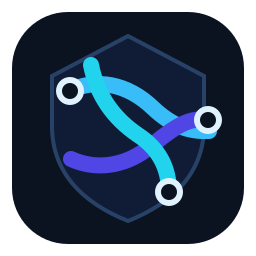
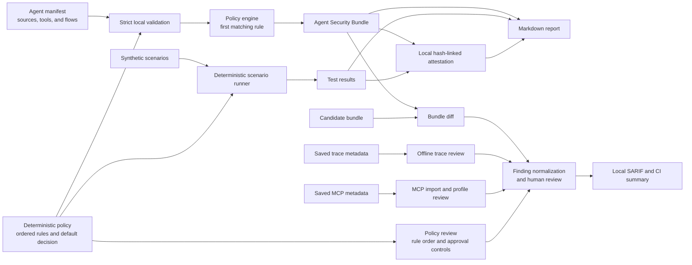

<p align="center">
  
</p>

<h1 align="center">TrustWeave</h1>

<p align="center">
  <strong>Static security review for AI-agent configurations.</strong><br>
  Local and deterministic: no agent execution, no network calls, no data leaves your machine.
</p>

<p align="center">
  <a href="https://pypi.org/project/trustweave/"></a>
  <a href="https://github.com/MohammadThabetHassan/trustweave/actions/workflows/ci.yml"></a>
  <a href="https://pypi.org/project/trustweave/"></a>
  <a href="LICENSE"></a>
</p>

<p align="center">
  <a href="#try-it-in-two-minutes">Try it</a> ·
  <a href="#what-it-does">What it does</a> ·
  <a href="docs/site/INTEGRATIONS.md">Integration routes</a> ·
  <a href="docs/CLI_REFERENCE.md">CLI reference</a> ·
  <a href="docs/site/CURRENT_EVIDENCE.md">Current evidence</a> ·
  <a href="docs/REPRODUCING_THE_STUDY.md">Reproducing the study</a> ·
  <a href="#docs">Docs</a> ·
  <a href="SECURITY.md">Security</a>
</p>

---

TrustWeave reads what an agent declares, namely its input sources, its tools and the policy
between them, and reports every path by which untrusted input can reach a privileged action. It
reviews declarations rather than a running deployment, and it produces evidence for a human
reviewer: enforcement stays with your runtime.

## Try it in two minutes

```bash
python -m pip install --upgrade trustweave
```

Scan a declared agent manifest against a policy:

```bash
git clone https://github.com/MohammadThabetHassan/trustweave.git
cd trustweave
python -m pip install -e .

trustweave scan \
  --manifest examples/support-agent.manifest.json \
  --policy policies/default-policy.json \
  --output-dir artifacts
```

Every declared trust-boundary path receives a decision:

| Source | Trust | Tool | Decision |
|---|---|---|---|
| customer_request | trusted | search_knowledge_base | **allow** |
| customer_record | conditional | send_mock_email | **require_approval** |
| customer_request | trusted | lookup_customer_record | **deny** |
| knowledge_base_document | untrusted | send_mock_email | **deny** |

Next, replay synthetic scenarios against the policy, attest the results and write the review
report. Three suites ship with the project: boundary regressions, 25 adversarial patterns, and a
12-case matrix that covers every trust and action combination, including the flows that must stay
permitted. The [scenario catalogue](scenarios/README.md) lists each case, what it targets and the
rule that decides it.

```bash
trustweave test \
  --policy policies/default-policy.json \
  --scenarios scenarios/default-scenarios.json \
  --output-dir artifacts

trustweave attest --source-revision local --output-dir artifacts
trustweave report --output-dir artifacts

# Check that the evidence files are unchanged since the attestation:
trustweave verify \
  --attestation artifacts/attestation.json \
  --bundle artifacts/agent-security-bundle.json \
  --test-results artifacts/security-test-results.json
```

The example uses only checked-in files. Every command documents itself through
`trustweave --help` or `python -m trustweave --help`. For a longer example, see the
[research-assistant demo](demo/research-assistant/) or the [walkthrough](docs/site/WALKTHROUGH.md).

Bundles follow the `trustweave.dev/bundle/v1alpha2` contract, and risk decisions carry stable
`trustweave/fingerprint/v4` identities. Given bundle and test-result paths, `verify` checks those
exact bytes; given only an attestation, it checks only the statement’s internal consistency.

## What it does

A configuration change can open a sensitive path, such as an untrusted source reaching an
external tool, without any change to application code. TrustWeave finds such paths at review time.

- **`scan`** maps every declared flow from source to tool to action and applies the policy.
- **`diff`** shows what a candidate configuration changes against a baseline.
- **`discover`** reads local Python source, lists the tools an agent can reach, proposes an
  action class for each with the evidence behind it, and reports what the manifest leaves
  undeclared. It is on `main` but not yet released; install from source to use it.
- **`test`** replays synthetic scenarios, so a policy regression fails in CI instead of in
  production.
- **`trace-review`** and **`mcp-profile-check`** report where recorded metadata has drifted from
  the declaration.

## How the local evidence workflow fits together

The workflow turns declared files and previously saved metadata into review artifacts.


```mermaid
flowchart LR
    M["Agent manifest<br/>sources, tools, and flows"] --> V["Strict local validation"]
    P["Deterministic policy<br/>ordered rules and default decision"] --> V
    V --> E["Policy engine<br/>first matching rule"]
    E --> B["Agent Security Bundle"]

    S["Synthetic scenarios"] --> T["Deterministic scenario runner"]
    P --> T
    T --> TR["Test results"]

    B --> D["Bundle diff"]
    B2["Candidate bundle"] --> D
    L["Saved trace metadata"] --> RV["Offline trace review"]
    MP["Saved MCP metadata"] --> MR["MCP import and profile review"]
    P --> PC["Policy review<br/>rule order and approval controls"]

    B --> A["Local hash-linked attestation"]
    TR --> A
    B --> R["Markdown report"]
    TR --> R
    A --> R

    D --> RK["Finding normalization<br/>and human review"]
    RV --> RK
    MR --> RK
    PC --> RK
    RK --> SA["Local SARIF and CI summary"]
```

TrustWeave produces evidence and does not enforce it. A `require_approval` decision, for example,
records the outcome and any declared approval bindings; the surrounding system implements the
approval itself.

### Example policy decision matrix

The quickstart policy is ordered: the **first matching rule wins**, and a declared path that no
rule matches receives the policy's `default_decision`, here `deny`.

| Declared path | Decided by | Decision | Finding | Reason |
| --- | --- | --- | --- | --- |
| `customer_request` (trusted) → `search_knowledge_base` (read) | `TW-001` | **allow** | informational | Trusted requests may use read-only tools. |
| `customer_request` (trusted) → `lookup_customer_record` (sensitive) | default | **deny** | high | No rule matches this path, so the default applies and the policy fails closed. |
| `customer_record` (conditional) → `send_mock_email` (external) | `TW-002` | **require_approval** | medium | Conditional data reaches an external action only after human review. |
| `knowledge_base_document` (untrusted) → `send_mock_email` (external) | `TW-004` | **deny** | high | Untrusted retrieved content must not drive an external action. |

The example tools have no side effects: `send_mock_email` writes a local event and sends nothing.
Run `trustweave policy-check` to find shadowed rules, fail-open defaults and incomplete approval
controls before relying on a policy in CI. The [architecture guide](docs/ARCHITECTURE.md) and the
[policy review guide](docs/site/POLICY_REVIEW.md) give the full contract.

## Pick your entry point

| You already have | Start here |
| --- | --- |
| A LangGraph, OpenAI Agents, or CrewAI export | [Framework import](docs/FRAMEWORK_IMPORT.md) |
| A saved MCP `tools/list` snapshot | [MCP import](docs/MCP_IMPORT.md) |
| A CI pipeline | [Local CI integration](docs/CI_INTEGRATIONS.md) |
| Nothing yet | The quickstart above |

The [Developer integration routes](docs/site/INTEGRATIONS.md) page has the commands for each route.

<a name="docs"></a>
## Docs

**Using it:** [Installation](docs/site/INSTALLATION.md) · [CLI reference](docs/CLI_REFERENCE.md) · [Rule catalog](docs/site/RULE_CATALOG.md) · [Troubleshooting](docs/site/TROUBLESHOOTING.md) · [Configuration](docs/CONFIGURATION.md)

**Understanding it:** [Concepts](docs/site/concepts.md) · [How it compares](docs/site/COMPARISON.md) · [Architecture](docs/ARCHITECTURE.md) · [Threat model](docs/THREAT_MODEL.md) · [Product contract](docs/PRODUCT_CONTRACT.md) · [Reviewer workflow](docs/REVIEWER_WORKFLOW.md)

**Trusting it:** [Current evidence](docs/site/CURRENT_EVIDENCE.md) · [Quality and test gates](docs/QUALITY.md) · [Mutation testing record](docs/MUTATION_TESTING.md) · [Supply-chain evidence](docs/SUPPLY_CHAIN.md) · [Reproducibility](docs/REPRODUCIBILITY.md) · [Reproducing the study](docs/REPRODUCING_THE_STUDY.md) · [Evaluation framework](docs/evaluation/EVALUATION_CHARTER.md)

<details>
<summary><strong>Schemas, risk management and release records</strong></summary>

- [Schema and compatibility policy](docs/SCHEMA_AND_COMPATIBILITY.md)
- [Local risk management](docs/RISK_MANAGEMENT.md): fingerprints, baselines and suppressions
- [Control traceability](docs/CONTROL_TRACEABILITY.md)
- [Golden deterministic evidence](docs/GOLDEN_EVIDENCE.md)
- [Resource bounds](docs/RESOURCE_BOUNDS.md)
- [Release guide](docs/RELEASE.md) and [release history](https://github.com/MohammadThabetHassan/trustweave/releases)
- Historical release checklists, migration guides and audit records are under `docs/archive/`.

</details>

## Quality

- 95% branch coverage, enforced in CI.
- 97.93% mutation score over the sixteen gated high-risk modules (7,722 of 7,885 mutants,
  recorded 2026-09-07), with every survivor triaged in the
  [mutation testing record](docs/MUTATION_TESTING.md).
- Reproducible wheels with a fixed build epoch, an SBOM and PyPI provenance attestations.
- No runtime dependencies. YAML manifests need the optional extra:
  `pip install "trustweave[yaml]"`.

[QUALITY.md](docs/QUALITY.md) has the details. The latest release on PyPI is 0.3.0, and `main`
carries the unreleased 0.3.1 changes; see the [release guide](docs/RELEASE.md).

## Research

The measurement artifacts, protocols and analysis scripts behind the TrustWeave research live in
`docs/` and `scripts/`. [Reproducing the study](docs/REPRODUCING_THE_STUDY.md) maps each result
to the command that produces it, and the [research note](docs/site/RESEARCH_NOTE.md) explains where
the write-ups will appear.

## Contributing

Bug reports and pull requests are welcome: see [CONTRIBUTING.md](CONTRIBUTING.md), and
[SUPPORT.md](SUPPORT.md) for questions. Report vulnerabilities privately as described in
[SECURITY.md](SECURITY.md), not in public issues. Community norms are in
[CODE_OF_CONDUCT.md](CODE_OF_CONDUCT.md) and project decisions in [GOVERNANCE.md](GOVERNANCE.md).
If you have used TrustWeave on a real agent, a short [case study](docs/CASE_STUDIES.md) helps
other teams decide.

## Team

Ahmed Sami Alameri, Fahad Sadek, Omar Alraas, Abdulrahman Rezki and Mohammad Thabet Hassan,
supervised by Dr. Lobna AbuSerrieh, Canadian University Dubai. Citation metadata is in
[CITATION.cff](CITATION.cff).

## License

[Apache License 2.0](LICENSE).
