# Declaration-consistency case demos

This directory contains a terminal-style walkthrough for every checked-in declaration-consistency fixture. Each animation is generated from an actual local run of [`run-case.sh`](run-case.sh), and each matching `.cast` file records the captured terminal output in an asciinema-compatible format.

> **Scope boundary:** These are synthetic local fixtures. They compare exact labels in supplied static descriptors and supplied TrustWeave manifests. They do not import or execute OpenAI Agents, LangGraph, or CrewAI; authenticate the inputs; inspect source; establish runtime reachability; or prove security.

## Reproduce one case

```shell
./run-case.sh TW-COMP-011
```

The runner first validates the selected checked-in fixture, verifies the complete fixture-provenance record, evaluates exactly that case, and writes its local report to `artifacts/TW-COMP-011/`.

## Case walkthroughs

| Case | What the actual local comparison shows | GIF | Cast |
| --- | --- | --- | --- |
| `TW-COMP-001` | Exact agreement across a complete OpenAI Agents-style static tool surface. | [demo](cases/TW-COMP-001.gif) | [cast](cases/TW-COMP-001.cast) |
| `TW-COMP-002` | A framework-only static label (`webhook_notify`) requiring review. | [demo](cases/TW-COMP-002.gif) | [cast](cases/TW-COMP-002.cast) |
| `TW-COMP-003` | A manifest-only static label (`audit_log`) requiring review. | [demo](cases/TW-COMP-003.gif) | [cast](cases/TW-COMP-003.cast) |
| `TW-COMP-004` | Raw bidirectional differences plus transparent declared reconciliation. | [demo](cases/TW-COMP-004.gif) | [cast](cases/TW-COMP-004.cast) |
| `TW-COMP-005` | An empty framework inventory against a single manifest label. | [demo](cases/TW-COMP-005.gif) | [cast](cases/TW-COMP-005.cast) |
| `TW-COMP-006` | Minimal one-tool exact agreement. | [demo](cases/TW-COMP-006.gif) | [cast](cases/TW-COMP-006.cast) |
| `TW-COMP-007` | Multi-agent overlapping labels deduplicated for comparison. | [demo](cases/TW-COMP-007.gif) | [cast](cases/TW-COMP-007.cast) |
| `TW-COMP-008` | Multiple framework-only static labels left unresolved. | [demo](cases/TW-COMP-008.gif) | [cast](cases/TW-COMP-008.cast) |
| `TW-COMP-009` | Multiple manifest-only static labels left unresolved. | [demo](cases/TW-COMP-009.gif) | [cast](cases/TW-COMP-009.cast) |
| `TW-COMP-010` | Bidirectional unresolved static-label drift. | [demo](cases/TW-COMP-010.gif) | [cast](cases/TW-COMP-010.cast) |
| `TW-COMP-011` | Partial reconciliation that leaves remaining labels unresolved. | [demo](cases/TW-COMP-011.gif) | [cast](cases/TW-COMP-011.cast) |
| `TW-COMP-012` | A LangGraph-style graph-only descriptor boundary. | [demo](cases/TW-COMP-012.gif) | [cast](cases/TW-COMP-012.cast) |
| `TW-COMP-013` | Exact agreement for a CrewAI-style agent/task descriptor. | [demo](cases/TW-COMP-013.gif) | [cast](cases/TW-COMP-013.cast) |
| `TW-COMP-014` | A CrewAI-style framework-only static label. | [demo](cases/TW-COMP-014.gif) | [cast](cases/TW-COMP-014.cast) |

## Gallery

### `TW-COMP-001` — complete declared tool surface

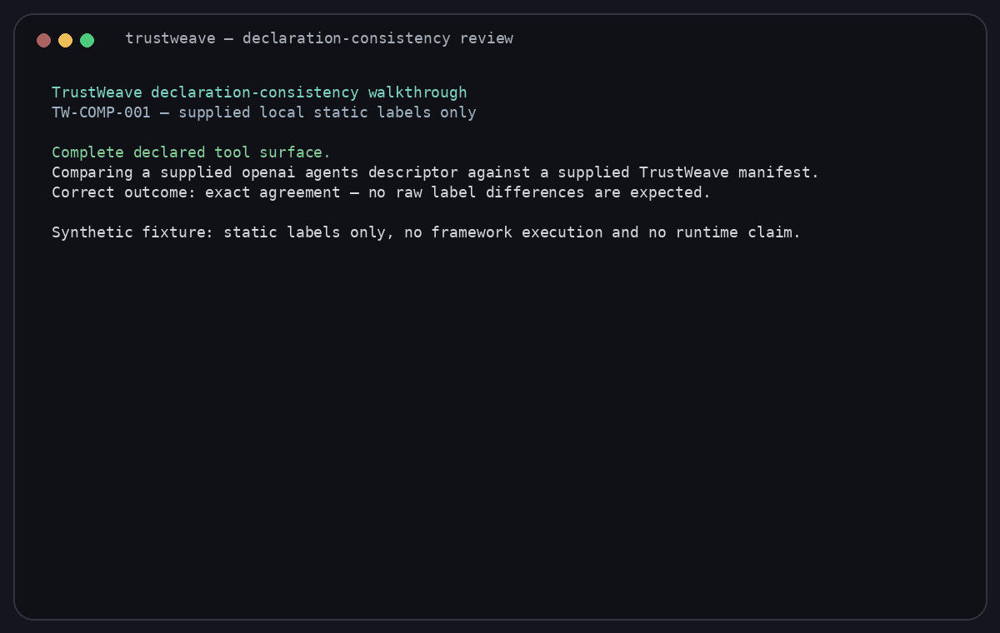

### `TW-COMP-002` — framework-only static tool label

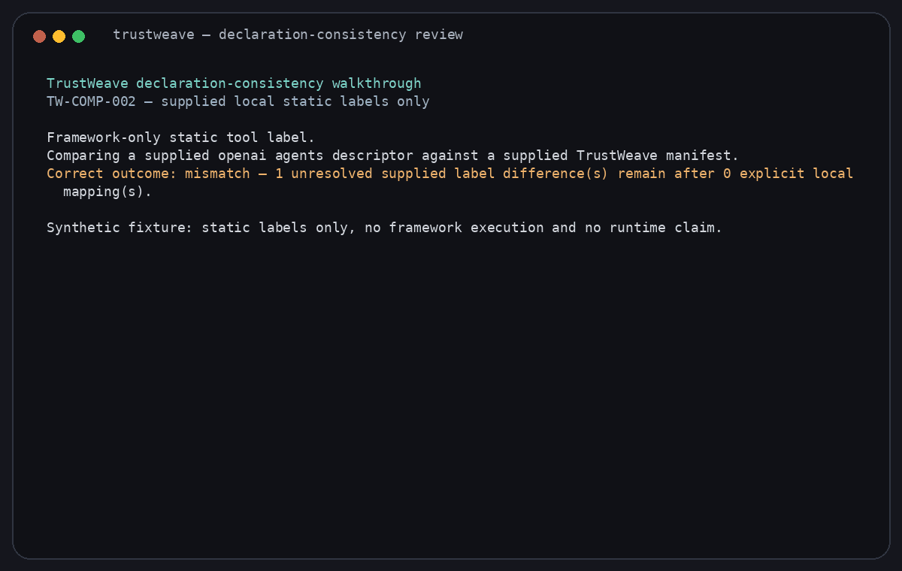

### `TW-COMP-003` — manifest-only static tool label


### `TW-COMP-004` — declared reconciliation

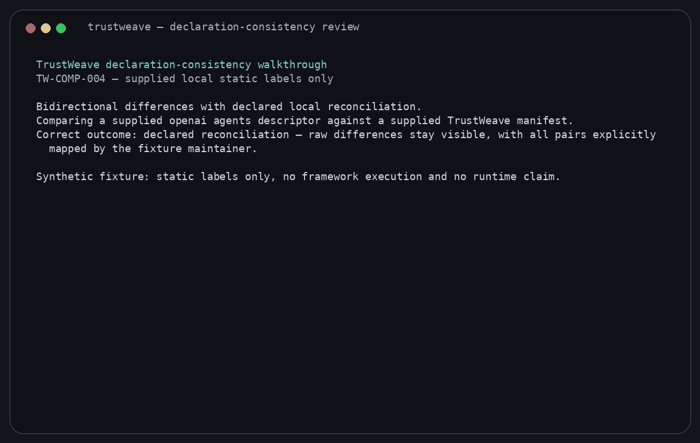

### `TW-COMP-005` — empty inventory boundary

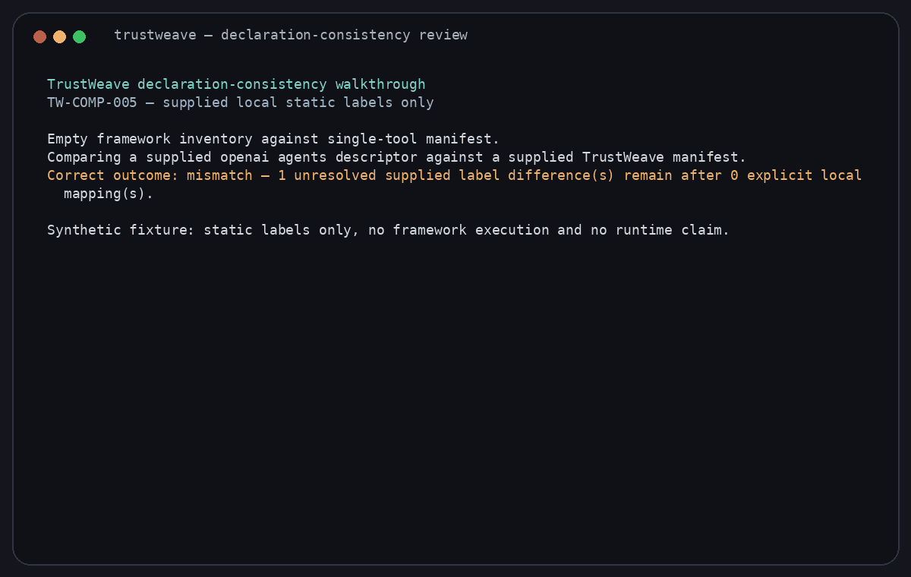

### `TW-COMP-006` — single-tool agreement

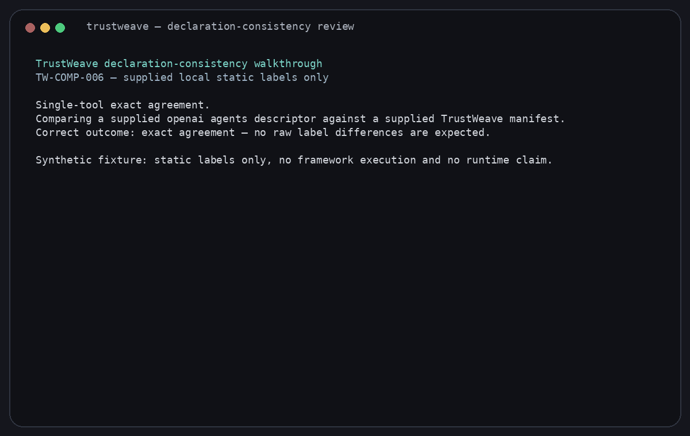

### `TW-COMP-007` — multi-agent overlap

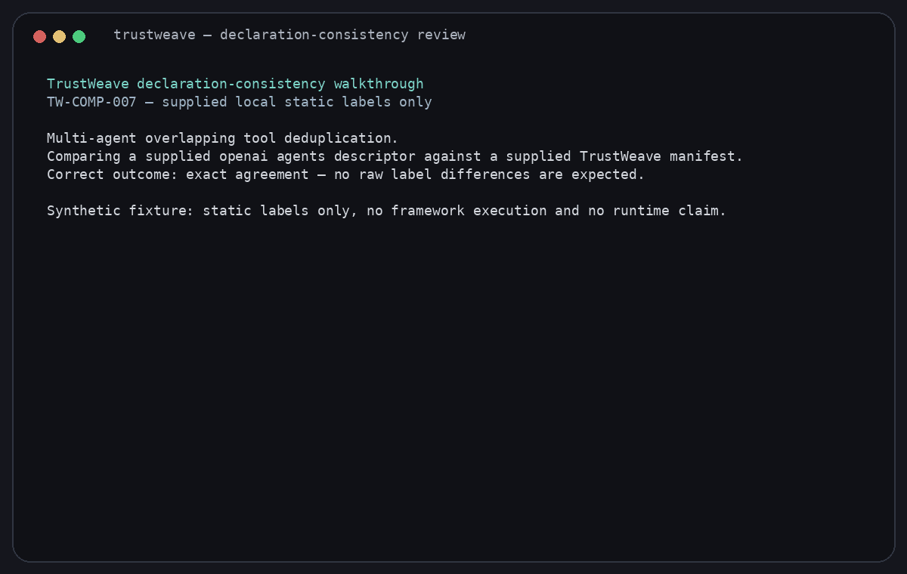

### `TW-COMP-008` — multiple framework-only labels

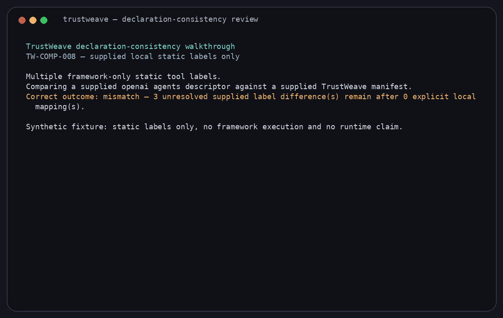

### `TW-COMP-009` — multiple manifest-only labels


### `TW-COMP-010` — bidirectional unresolved drift


### `TW-COMP-011` — partial reconciliation

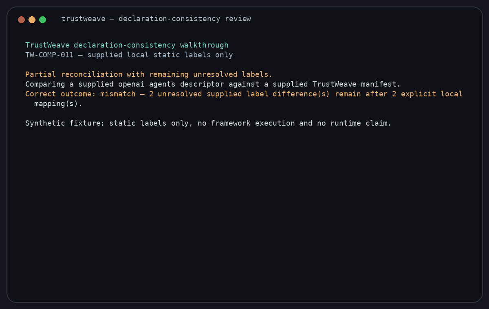

### `TW-COMP-012` — LangGraph-style descriptor boundary

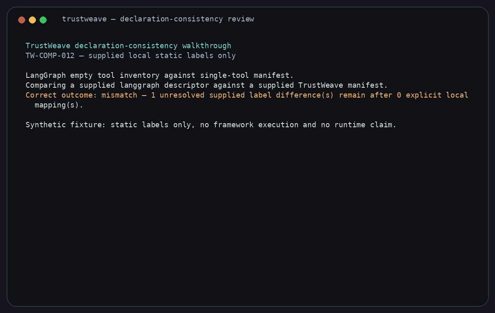

### `TW-COMP-013` — CrewAI-style agreement

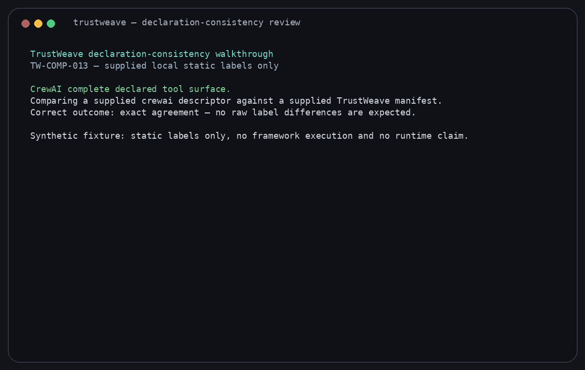

### `TW-COMP-014` — CrewAI-style mismatch

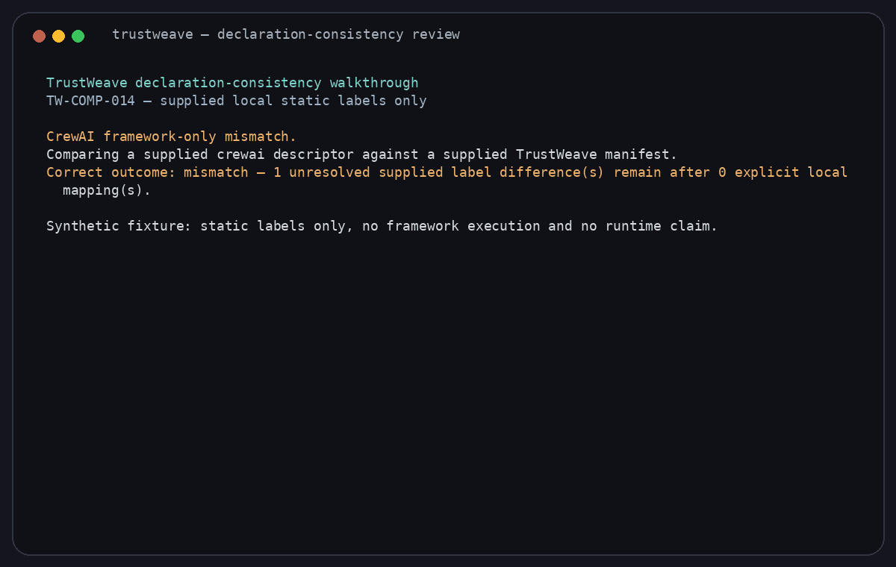

## Regenerate the gallery

Install the small optional renderer extra, then run the deterministic renderer from the repository root:

```shell
pip install -e '.[demo]'
python3 scripts/render_declaration_consistency_demos.py
```

It executes every case through `run-case.sh`, writes a matching terminal cast, and rebuilds each GIF from the captured local output. The generated files are review illustrations for this checked-in synthetic corpus only; they are not evidence of a live framework run.
