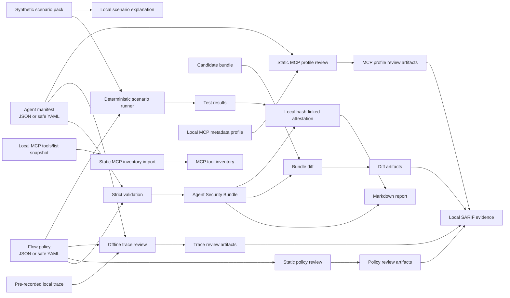

# TrustWeave Architecture

## Design objective

TrustWeave is a local, deterministic evidence workflow. It consumes a declared agent manifest, a declared policy, and a synthetic scenario pack. It then writes structured artifacts that can be reviewed, retained as CI evidence, or compared across revisions. The [current-evidence record](site/CURRENT_EVIDENCE.md) distinguishes source-candidate status, published-release status, and the scope of the recorded quality evidence.

The design prioritizes **visibility, reproducibility, and safety** over autonomous discovery or broad runtime interception.

## Components

| Component | Responsibility | Safety property |
|---|---|---|
| `models.py` | Validates manifests, policies, trust labels, action classes, and references. | Rejects incomplete, unknown, malformed, or ambiguous declared inputs. |
| `engine.py` | Builds a bundle and applies first-match deterministic rules to every declared flow. | Never calls a model, tool, subprocess, or network service. |
| `scenarios.py` | Runs safe scenario assertions and renders cited local scenario explanations. | Does not execute a payload, prompt, model, tool, or configured server. |
| `evidence.py` | Hash-links canonical stable evidence payloads and records exact local-file hashes in an unsigned attestation. | States explicit limits; no claim of external signing or non-repudiation. |
| `risk.py` | Normalizes supplied local review findings with `trustweave/fingerprint/v3`, emits v1alpha2 lifecycle and mismatch states, and applies expiry-enforced decisions. | Does not remediate findings, contact ticketing systems, authenticate an approver, or inspect runtime behavior. |
| `policy_review.py` | Reviews ordered-rule shadowing and decisions that require human scrutiny. | Does not decide authorization or run a policy in a deployed runtime. |
| `diff.py` | Compares two generated bundles for declared source, tool, path, and decision changes. | Does not discover behavior, execute tools, or issue a security verdict. |
| `trace_review.py` | Compares local trace tool-call metadata with declared sources, tools, flows, and deterministic policy. | Does not execute a target, inspect message text/tool arguments, or treat a trace as an instruction. |
| `mcp_import.py` | Normalizes an already-provided MCP tools/list snapshot into a deterministic review inventory. | Does not discover a server, open a transport, retrieve metadata, handle tokens, infer authorization, or execute a tool. |
| `mcp_profile.py` | Validates local MCP metadata profiles and compares tool mappings/action classes with the manifest. | Does not discover a server, open a transport, retrieve metadata, handle tokens, or execute a tool. |
| `sarif.py` | Converts existing local review findings into deterministic SARIF 2.1.0 evidence. | Does not inspect a live target, upload results, enable code scanning, or perform a network request. |
| `report.py` | Renders review-friendly Markdown from generated artifacts. | Reads generated structured artifacts only and omits sensitive trace fields. |
| `cli.py` | Exposes the local workflow through a predictable CLI. | Returns non-zero on invalid data or failed synthetic scenarios. |

## Artifact contracts

### Agent Security Bundle

The bundle is the main review artifact. It contains the validated manifest, normalized policy, decision-level findings, counts by decision, and explicit limits. A finding binds one declared source, one declared tool, one flow, a final deterministic decision, and the matching policy-rule identifier when present.

### Synthetic test results

Synthetic results are intentionally simple. A scenario specifies only a source trust label, a tool action class, and an expected decision. The test runner reports the observed decision, matching rule, and pass/fail status. The format is suitable for CI without exposing real data or needing a live agent.

### Local attestation

The attestation records SHA-256 digests of the exact bundle and test-results files, canonical stable-payload digests, the stated source revision, and an integrity chain derived from the stable digests. Volatile `generated_at` metadata is injected at the CLI boundary and excluded from the v1alpha3 stable integrity chain. It is internally verifiable with `trustweave verify`.

> **Important:** The local v1alpha3 attestation is not externally signed and is not backed by a transparency log. It proves only an internally consistent relationship among supplied local artifacts after generation. Future DSSE, in-toto, or Sigstore integration is intentionally out of scope.

### Policy review

The policy-review artifact checks six deterministic conditions: whether an ordered rule is shadowed by an earlier rule, whether an unmatched flow defaults to `allow`, whether a rule allows an untrusted input to a sensitive or external action class, whether a sensitive/external `require_approval` path lacks a declared approval control, whether that control binds approval to the action context, and whether the declaration fails closed. Required bindings are the actor, tool, target, parameters, issuance time, and expiry. A finding is an obligation for human review, never an automatic block, authorization result, or vulnerability conclusion.

### Bundle diff

The current v1alpha3 bundle-diff artifact is unreleased branch behavior; it compares compatible v1alpha1 or v1alpha2 bundle inputs and records both input versions. It records additions, removals, and modifications to declared sources and tools; exact capability additions/removals for each existing changed tool; added and removed paths; and a distinct strictly bounded policy delta for policy-decision or matching-rule changes. It emits review signals for a newly introduced or changed sensitive/external tool, capability growth on an existing sensitive/external tool, an untrusted-input path to a sensitive/external action that is not denied, fail-closed-to-fail-open (`TW-DIFF-004`), default-to-allow (`TW-DIFF-005`), approval-control removal (`TW-DIFF-006`), approval-binding removal (`TW-DIFF-007`), less-restrictive rule decisions (`TW-DIFF-008`), required-control removal (`TW-DIFF-009`), classification-taxonomy change (`TW-DIFF-010`), and structural policy-rule changes (`TW-DIFF-011`). `TW-DIFF-011` covers added or removed rules, matching-predicate changes, and reordering only where changed relative order can affect first-match coverage; it requests human review and does not prove that every listed change is insecure or that every possible policy weakening was detected. Published `0.2.3` emits v1alpha2; any release containing v1alpha3 needs a new authorized version. The retained v1alpha1/v1alpha2 schemas remain readable only by bounded historical consumers.

### Offline trace review

The trace-review artifact consumes a strictly validated local trace with `messages`, `tool_calls`, and `events`. It records only message counts, tool names, declared source names, event-type counts, deterministic decisions, and review findings. It deliberately does not inspect or copy message content, tool arguments, credentials, or arbitrary event payloads. It reports undeclared sources/tools/flows and observed calls that the declared policy denies or requires approval.

### Cited synthetic scenarios

The adversarial scenario pack stores only trust labels, action classes, expected decisions, explanatory rationales, and public reference URLs. `explain` renders those fields from local data. The pack contains no live endpoints, prompt payloads, model invocation, tool configuration, credential, or external request. A passing scenario confirms a local policy decision only.

### Local MCP tools-list inventory

The MCP inventory command normalizes an already-provided local `tools/list` snapshot into a stable tool inventory. It validates unique names, object-valued input schemas, and selected annotation types while treating all metadata as review data rather than authority. It intentionally does not infer a TrustWeave action class, create a manifest, contact an endpoint, authenticate, discover a tool, or execute a call.

### MCP metadata profile review

The MCP profile-review artifact validates an explicit local profile containing transport, HTTP resource identifier when relevant, authorization expectation, and a tool-to-manifest mapping. It rejects URI credentials, query parameters, and fragments; surfaces an HTTP profile that does not expect authorization; flags unknown manifest mappings and action-class drift; and reports a minimized mapping. It treats the profile as local metadata only and does not retrieve remote server metadata, connect to a transport, validate OAuth, process a token, or execute a tool.

### Local SARIF evidence

The `sarif` command converts selected policy, bundle-diff, trace, and MCP-profile review artifacts into SARIF 2.1.0. It uses stable sorting and a SHA-256-derived partial fingerprint for each finding, recording the local review-artifact path as the finding location. It does not generate new security conclusions, upload a result, configure GitHub Code Security, or prove a runtime’s behavior. A separate, explicitly authorized integration can consume the resulting file.

## Policy semantics

Policies use ordered rules. A rule matches when its source-trust label and tool action class match. Optional `source_data_classifications` and `tool_capabilities` constraints narrow a rule further; capability constraints use bounded shell-style globs such as `email.*`, never executable expressions. The first matching rule determines the result. When no rule matches, TrustWeave uses the policy’s `default_decision`.

Supported trust labels are `trusted`, `untrusted`, and `conditional`. Supported action classes are `read`, `write`, `sensitive`, and `external`. Supported decisions are `allow`, `deny`, and `require_approval`. Findings use deterministic default severities of `high` for denied paths, `medium` for approval-required paths, and `info` for allowed paths; a policy rule may declare one of `critical`, `high`, `medium`, `low`, or `info` as an explicit override.

The `require_approval` result is an evidence decision, not a human-approval implementation. An optional policy-level `approval_control` declaration records a mechanism label, the fields an approval is bound to, and whether validation fails closed. `trustweave policy-check --exit-on-review` can act as a deterministic CI gate for review findings. TrustWeave does not implement an approval workflow, contact a reviewer, authenticate an approver, or validate approval at runtime.

## Extension boundaries

The following capabilities are intentionally represented as adapters or future work rather than embedded assumptions.

| Capability | Current position | Rationale |
|---|---|---|
| MCP discovery or proxying | Not implemented | Running server configurations would violate the local, non-executing MVP boundary. |
| OPA/Rego | Future adapter | Keeps the initial policy semantics understandable and dependency-free. |
| Relationship authorization | Future adapter | Requires an authoritative identity/tenant model outside this repository’s scope. |
| Model and framework SDKs | Future adapter | A core evidence contract should be stable before framework-specific hooks are added. |
| Real runtime traces | Future adapter | Privacy, retention, and integrity requirements need a dedicated design. |
| External signatures | Future adapter | Requires key custody and verification lifecycle decisions. |

## Engineering invariants

1. **No hidden execution:** a manifest is data, never code.
2. **Explicit provenance:** core builders do not read a clock or environment; the CLI resolves optional generation metadata.
3. **No implicit trust:** every source has an explicit trust label.
4. **Fail closed:** malformed documents, unknown references, and unmatched policy paths lead to errors or the explicit default decision.
5. **Evidence before claims:** reports include scope limits and avoid deployment-security guarantees.
6. **Reproducible inputs:** examples, policy rules, and scenarios are versioned in the repository.
7. **Diffs require context:** a review signal highlights an explicit change but does not replace review of the manifest, policy, and authorization design.
8. **Least privilege is reviewable:** added/removed declared capabilities are preserved in bundle-diff evidence, while a capability-growth signal on sensitive/external tools still requires human authorization review.
9. **Trace minimization:** trace evidence is metadata, not executable input; reports exclude message content and tool arguments.
10. **MCP metadata is declarative:** a profile is never a connection instruction, credential source, or protocol-conformance claim.
11. **Risk decisions expire:** a baseline or suppression is explicit, local, reasoned, and time-bounded; expiry returns the finding to active reviewer attention.
